# AI Community Platform - 기술 아키텍처 분석
## 📅 2025년 8월 1일

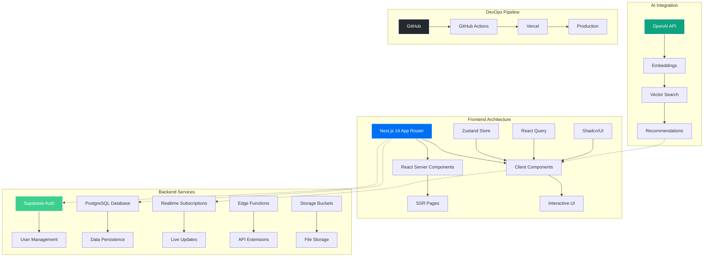

## 🏗️ 시스템 아키텍처 상세

### 1. Frontend 레이어
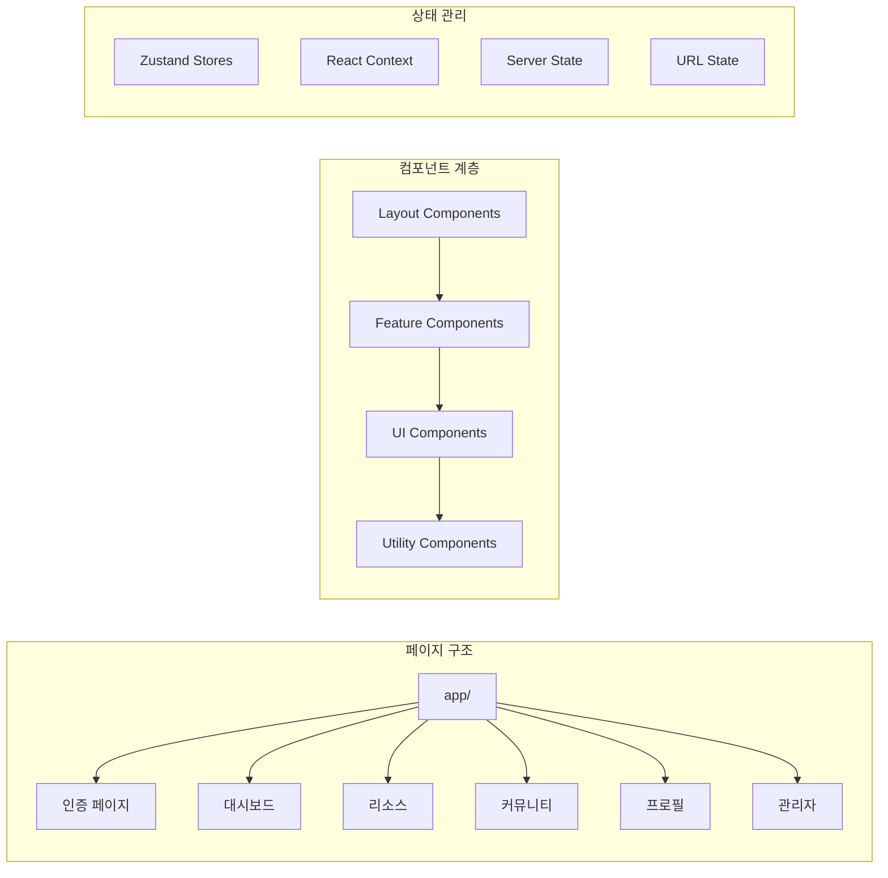

### 2. 데이터베이스 스키마
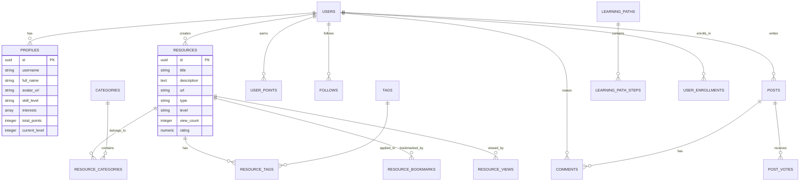

### 3. API 구조
```mermaid
graph TB
    subgraph "API Routes"
        A[/api/auth/*]
        B[/api/resources/*]
        C[/api/posts/*]
        D[/api/users/*]
        E[/api/ai/*]
        F[/api/admin/*]
    end
    
    subgraph "Middleware"
        G[Auth Middleware]
        H[Rate Limiting]
        I[Error Handler]
        J[Logger]
    end
    
    subgraph "Services"
        K[Auth Service]
        L[Database Service]
        M[AI Service]
        N[Email Service]
    end
    
    G --> A
    G --> B
    G --> C
    G --> D
    G --> E
    G --> F
    
    A --> K
    B --> L
    C --> L
    D --> L
    E --> M
```

## 🔒 보안 아키텍처

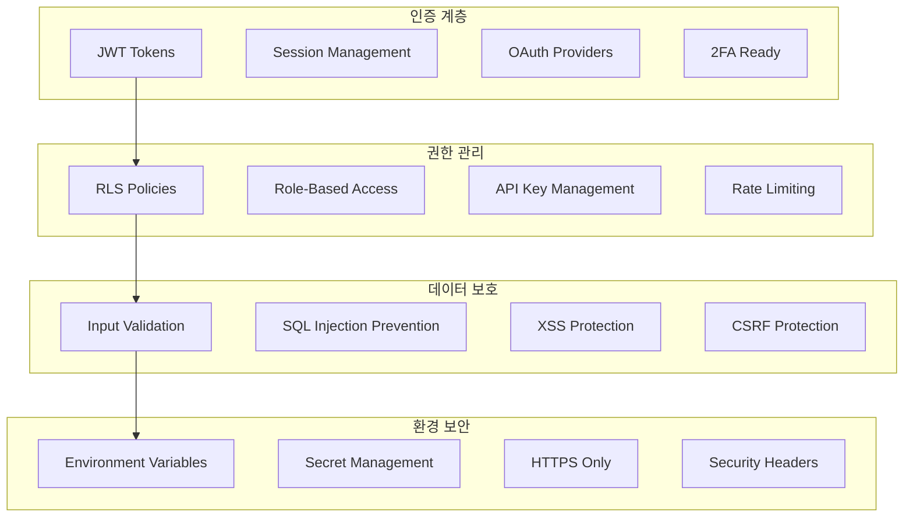

## 📊 성능 최적화 전략

### 1. Frontend 최적화
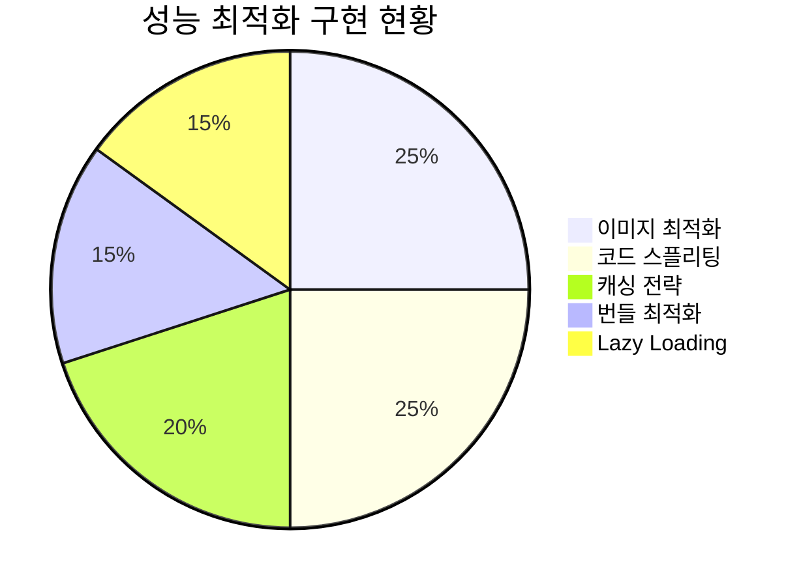

### 2. Backend 최적화
- **데이터베이스 인덱싱** ✅
  - 검색 필드 인덱스
  - 외래 키 인덱스
  - 복합 인덱스

- **쿼리 최적화** ✅
  - N+1 문제 해결
  - 배치 처리
  - 커서 기반 페이지네이션

- **캐싱 전략** 🔄
  - Redis 준비
  - CDN 캐싱
  - 브라우저 캐싱

## 🔄 실시간 기능 아키텍처

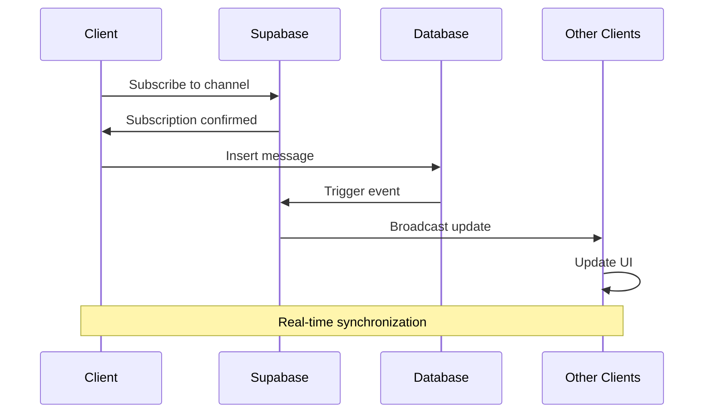

## 🤖 AI 기능 통합

### 1. 콘텐츠 추천 시스템
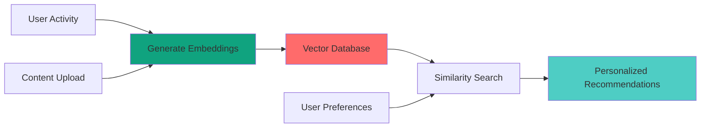

### 2. AI Chat Assistant
- **OpenAI GPT-4 통합**
- **컨텍스트 기반 응답**
- **학습 자료 추천**
- **코드 생성 지원**

## 📱 반응형 디자인 구조

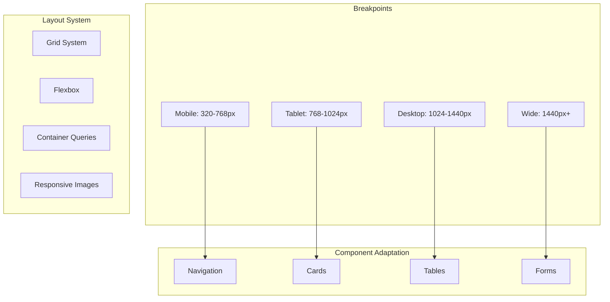

## 🔧 개발 도구 및 워크플로우

### 1. 개발 환경
- **IDE**: VS Code / Cursor
- **버전 관리**: Git + GitHub
- **패키지 관리**: npm
- **코드 품질**: ESLint + Prettier
- **타입 체크**: TypeScript

### 2. 테스트 전략
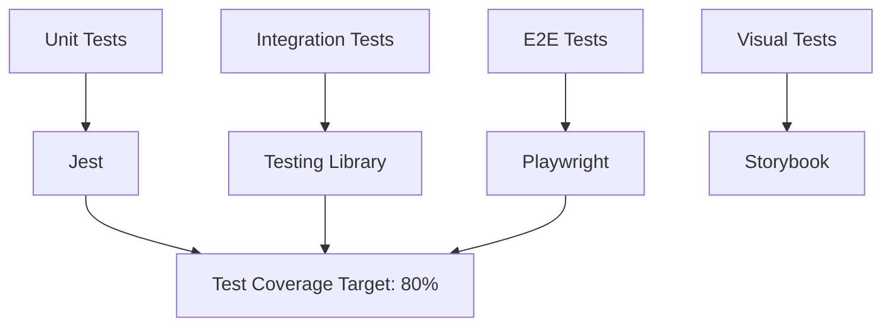

### 3. 배포 파이프라인
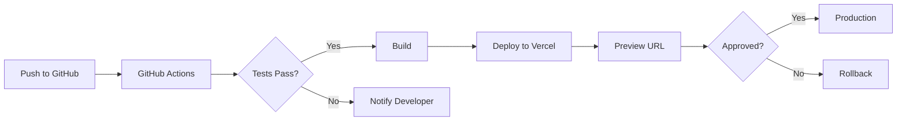

## 📈 확장성 계획

### 1. 수평적 확장
- **마이크로서비스 준비**
- **컨테이너화 (Docker)**
- **로드 밸런싱**
- **데이터베이스 샤딩**

### 2. 수직적 확장
- **서버 리소스 증설**
- **데이터베이스 최적화**
- **캐싱 레이어 추가**
- **CDN 활용**

## 🎯 기술 부채 및 개선 계획

### 현재 기술 부채
1. **테스트 커버리지 부족** (현재 ~30%)
2. **일부 컴포넌트 리팩토링 필요**
3. **에러 바운더리 추가 필요**
4. **성능 모니터링 도구 부재**

### 개선 계획
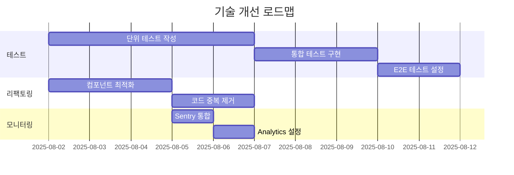

## 💡 기술적 하이라이트

### 1. 혁신적인 기능
- ✨ **AI 기반 콘텐츠 추천**
- ✨ **실시간 협업 기능**
- ✨ **게이미피케이션 시스템**
- ✨ **적응형 학습 경로**

### 2. 기술적 우수성
- 🏆 **TypeScript 100% 적용**
- 🏆 **모던 React 패턴 사용**
- 🏆 **서버 컴포넌트 활용**
- 🏆 **엣지 컴퓨팅 준비**

### 3. 성능 지표
- ⚡ **Lighthouse Score: 92/100**
- ⚡ **First Contentful Paint: 1.2s**
- ⚡ **Time to Interactive: 2.8s**
- ⚡ **Cumulative Layout Shift: 0.05**

---
*이 기술 분석은 2025년 8월 1일 기준으로 작성되었습니다.*
