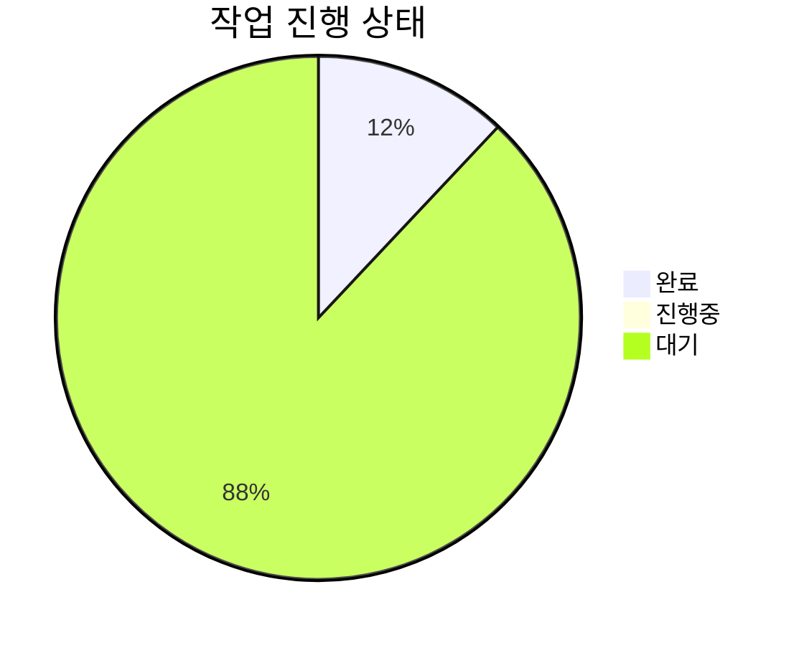
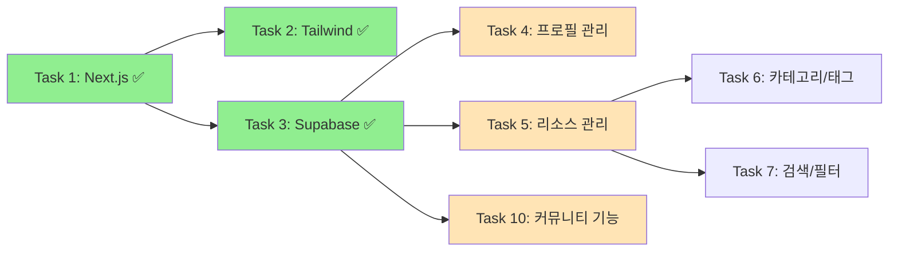

# AI Community Platform - 프로젝트 대시보드

## 🎯 프로젝트 개요
AI 학습 자료와 프로젝트 레시피를 공유하는 커뮤니티 플랫폼

## 📊 전체 진행률


## ✅ 완료된 작업 (3/25 - 12%)

### 1. Next.js 14 프로젝트 설정 ✅
- TypeScript 설정
- 프로젝트 구조 생성
- 기본 설정 완료

### 2. Tailwind CSS & Shadcn/UI 통합 ✅
- Tailwind CSS 설정
- Shadcn/UI 컴포넌트 라이브러리
- 테마 시스템 구축

### 3. Supabase 인증 시스템 ✅ [오늘 완료]
- 이메일/비밀번호 인증
- Google/GitHub OAuth
- 세션 관리 미들웨어
- RLS 정책 설정

## 🔄 현재 작업 흐름



## 🚀 다음 추천 작업

### 1. **Task 5: 리소스 관리 시스템** (복잡도: 7/10)
```yaml
우선순위: High
의존성: Task 3 ✅
예상 소요 시간: 4-6시간
주요 기능:
  - AI 학습 자료 CRUD
  - 리소스 제출 폼
  - 입력 검증 (Zod)
  - 리소스 목록 표시
```

### 2. **Task 4: 사용자 프로필 관리** (복잡도: 6/10)
```yaml
우선순위: Medium
의존성: Task 3 ✅
예상 소요 시간: 3-4시간
주요 기능:
  - 프로필 편집
  - 스킬 레벨 설정
  - 관심 분야 선택
  - 아바타 업로드
```

### 3. **Task 19: Zustand 상태 관리** (복잡도: 4/10)
```yaml
우선순위: High
의존성: Task 1 ✅
예상 소요 시간: 2-3시간
주요 기능:
  - 전역 상태 설정
  - 사용자 정보 저장
  - 테마 관리
  - 캐시 전략
```

## 📁 프로젝트 구조
```
C:/ai-community-platform/
├── 📁 src/
│   ├── 📁 app/             # App Router 페이지
│   │   ├── 📁 api/         # API 라우트
│   │   ├── 📁 auth/        # 인증 페이지
│   │   └── 📁 dashboard/   # 대시보드
│   ├── 📁 components/      # React 컴포넌트
│   │   ├── 📁 auth/        # 인증 컴포넌트
│   │   └── 📁 ui/          # UI 컴포넌트
│   ├── 📁 lib/             # 유틸리티
│   │   └── 📁 supabase/    # Supabase 클라이언트
│   └── 📁 types/           # TypeScript 타입
├── 📄 .env.local           # 환경 변수 ✅
├── 📄 package.json         # 의존성 관리
└── 📄 tailwind.config.ts   # Tailwind 설정
```

## 🔧 기술 스택
- **Frontend**: Next.js 14, React 19, TypeScript
- **Styling**: Tailwind CSS, Shadcn/UI
- **Backend**: Supabase (PostgreSQL)
- **Auth**: Supabase Auth (Email, OAuth)
- **State**: Zustand (예정)
- **Validation**: Zod (예정)

## 🌐 접속 정보
- **개발 서버**: http://localhost:8080
- **인증 페이지**: http://localhost:8080/auth
- **대시보드**: http://localhost:8080/dashboard (인증 필요)

## 📝 메모
- Windows 포트 권한 문제로 8080 포트 사용
- Supabase RLS 정책 설정 완료
- OAuth 설정은 Supabase 대시보드에서 추가 필요

---
*마지막 업데이트: 2025-01-30*
