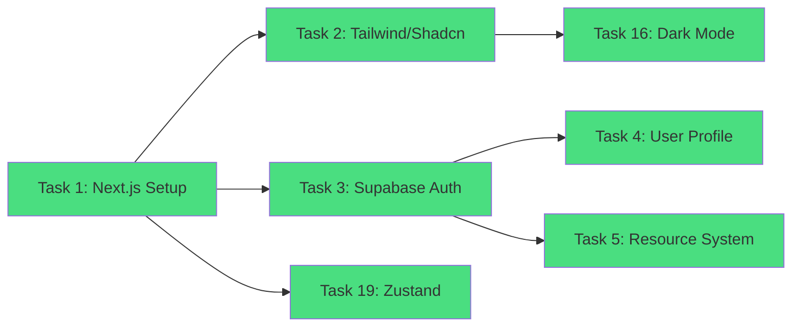
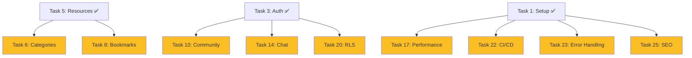

# AI Community Platform - 프로젝트 대시보드

## 📊 전체 진행 상황
- **완료**: 6/25 (24%)
- **진행 중**: 0
- **대기**: 19

## ✅ 완료된 작업


## 🔄 현재 가능한 작업


## 📁 프로젝트 구조
```
ai-community-platform/
├── 🟢 src/
│   ├── 🟢 app/(dashboard)/     # 인증된 영역
│   │   ├── 🟢 dashboard/       # 대시보드
│   │   ├── 🟢 resources/       # 리소스 관리
│   │   ├── 🟢 profile/         # 프로필
│   │   └── 🟢 users/           # 사용자 목록
│   ├── 🟢 components/
│   │   ├── 🟢 auth/            # 인증 컴포넌트
│   │   ├── 🟢 resources/       # 리소스 컴포넌트
│   │   ├── 🟢 layout/          # 레이아웃
│   │   └── 🟢 ui/              # UI 컴포넌트
│   ├── 🟢 services/            # 서비스 레이어
│   ├── 🟢 types/               # TypeScript 타입
│   └── 🟢 store/               # Zustand 스토어
└── 🟢 supabase/                # DB 스키마
```

## 🎯 다음 마일스톤
### Phase 1: 핵심 기능 (현재)
- [x] 기본 설정
- [x] 인증 시스템
- [x] 리소스 관리
- [ ] 카테고리/태그
- [ ] 검색/필터

### Phase 2: 커뮤니티 기능
- [ ] 게시물/댓글
- [ ] 팔로우 시스템
- [ ] 실시간 채팅
- [ ] 레벨 시스템

### Phase 3: 고급 기능
- [ ] 학습 경로
- [ ] 추천 시스템
- [ ] 주간 베스트
- [ ] 관리자 대시보드

## 📈 기술 스택 현황
- **Frontend**: Next.js 14, TypeScript, Tailwind CSS
- **UI**: Shadcn/UI, Lucide Icons
- **Backend**: Supabase (PostgreSQL)
- **State**: Zustand, React Context
- **Form**: React Hook Form, Zod

## 🔗 주요 링크
- 프로젝트 경로: `C:/ai-community-platform`
- Supabase: https://rxwchcvgzhuokpqsjatf.supabase.co
- Vercel: prj_yfqMcvg03DX7p3EABno5LGiW4tbu
