# AI Community Platform - 프로젝트 대시보드 v3

```mermaid
graph TB
    subgraph "✅ 완료된 작업 (7/25)"
        T1[Task 1: Next.js 14 Setup]:::done
        T2[Task 2: Tailwind/Shadcn UI]:::done
        T3[Task 3: Supabase Auth]:::done
        T4[Task 4: User Profile]:::done
        T5[Task 5: Resource Management]:::done
        T16[Task 16: Dark/Light Mode]:::done
        T19[Task 19: Zustand Setup]:::done
        T6[Task 6: Category & Tag System]:::done
    end

    subgraph "🚀 다음 추천 작업"
        T7[Task 7: Search & Filter]:::next
        T8[Task 8: Bookmarking System]:::next
        T17[Task 17: Performance Optimization]:::next
    end

    subgraph "📋 대기 중 작업 (17/25)"
        T9[Task 9: Learning Path]:::pending
        T10[Task 10: Community Features]:::pending
        T11[Task 11: User Level System]:::pending
        T12[Task 12: Follow System]:::pending
        T13[Task 13: Curation System]:::pending
        T14[Task 14: Real-time Chat]:::pending
        T15[Task 15: Weekly Best]:::pending
        T18[Task 18: Infinite Scrolling]:::pending
        T20[Task 20: Row Level Security]:::pending
        T21[Task 21: Input Validation]:::pending
        T22[Task 22: CI/CD Pipeline]:::pending
        T23[Task 23: Error Handling]:::pending
        T24[Task 24: Admin Dashboard]:::pending
        T25[Task 25: SEO Optimization]:::pending
    end

    %% 의존성 관계
    T1 --> T2
    T1 --> T3
    T1 --> T19
    T3 --> T4
    T3 --> T5
    T5 --> T6
    T6 --> T7
    T5 --> T8
    T5 --> T9
    T3 --> T10
    T10 --> T11
    T4 --> T12
    T10 --> T13
    T3 --> T14
    T10 --> T15
    T1 --> T17
    T10 --> T18
    T5 --> T20
    T5 --> T21
    T1 --> T22
    T3 --> T23
    T10 --> T24
    T1 --> T25

    classDef done fill:#4ade80,stroke:#22c55e,color:#000
    classDef next fill:#fbbf24,stroke:#f59e0b,color:#000
    classDef pending fill:#94a3b8,stroke:#64748b,color:#000
```

## 📊 프로젝트 진행 현황

### 전체 진행률: 32% (8/25 작업 완료)

| 구분 | 작업 수 | 비율 |
|------|---------|------|
| ✅ 완료 | 8 | 32% |
| 🚀 진행 예정 | 3 | 12% |
| 📋 대기 중 | 14 | 56% |

### 🏆 최근 완료 작업
1. **Task 6: Category & Tag System** (2025-01-31)
   - 계층적 카테고리 구조
   - 유연한 태그 시스템
   - 필터링 기능 구현

### 🎯 현재 상태
- **기본 인프라**: ✅ 완료
- **인증 시스템**: ✅ 완료
- **리소스 관리**: ✅ 완료
- **분류 시스템**: ✅ 완료
- **커뮤니티 기능**: 📋 대기 중
- **고급 기능**: 📋 대기 중

### 📈 우선순위별 분류
- **High**: 20% 완료 (4/20)
- **Medium**: 60% 완료 (3/5)
- **Low**: 0% 완료 (0/1)

### 🔧 기술 스택 활용도
- Next.js 14 App Router ✅
- TypeScript ✅
- Tailwind CSS + Shadcn/UI ✅
- Supabase (Auth, DB, RLS) ✅
- Zustand (상태 관리) ✅

### 📅 다음 단계 로드맵
1. **단기 (1-2일)**
   - Task 7: 고급 검색 기능
   - Task 8: 북마크 시스템
   
2. **중기 (3-5일)**
   - Task 17: 성능 최적화
   - Task 9: 학습 경로 시스템
   - Task 10: 커뮤니티 기능

3. **장기 (1-2주)**
   - Task 14: 실시간 채팅
   - Task 24: 관리자 대시보드
   - Task 22: CI/CD 파이프라인

### 💡 주요 성과
- 완전한 CRUD 시스템 구축
- 사용자 인증 및 프로필 관리
- 계층적 분류 체계
- 반응형 UI/UX
- 다크/라이트 모드 지원
