# AI Community Platform - 프로젝트 대시보드 v5

```mermaid
graph TB
    subgraph "✅ 완료된 작업 (16/25)"
        T1[Task 1: Next.js 14 Setup]:::done
        T2[Task 2: Tailwind/Shadcn UI]:::done
        T3[Task 3: Supabase Auth]:::done
        T4[Task 4: User Profile]:::done
        T5[Task 5: Resource Management]:::done
        T6[Task 6: Category & Tag System]:::done
        T7[Task 7: Search & Filter]:::done
        T8[Task 8: Bookmarking System]:::done
        T9[Task 9: Learning Path System]:::done
        T10[Task 10: Community Features]:::done
        T16[Task 16: Dark/Light Mode]:::done
        T19[Task 19: Zustand Setup]:::done
        T20[Task 20: Row Level Security]:::done
        T24[Task 24: Admin Dashboard]:::done
    end

    subgraph "🚀 다음 추천 작업"
        T13[Task 13: AI Curation System]:::next
        T14[Task 14: Real-time Chat]:::next
        T23[Task 23: Error Handling]:::next
    end

    subgraph "📋 대기 중 작업 (9/25)"
        T11[Task 11: User Level System]:::pending
        T12[Task 12: Follow System]:::pending
        T15[Task 15: Weekly Best]:::pending
        T17[Task 17: Performance Optimization]:::pending
        T18[Task 18: Infinite Scrolling]:::pending
        T21[Task 21: Input Validation]:::pending
        T22[Task 22: CI/CD Pipeline]:::pending
        T25[Task 25: SEO Optimization]:::pending
    end

    %% 의존성 관계
    T1 --> T2
    T1 --> T3
    T1 --> T19
    T3 --> T4
    T3 --> T5
    T5 --> T6
    T6 --> T7
    T5 --> T8
    T5 --> T9
    T3 --> T10
    T10 --> T11
    T4 --> T12
    T10 --> T13
    T3 --> T14
    T10 --> T15
    T1 --> T17
    T10 --> T18
    T5 --> T20
    T5 --> T21
    T1 --> T22
    T3 --> T23
    T10 --> T24
    T1 --> T25

    classDef done fill:#4ade80,stroke:#22c55e,color:#000
    classDef next fill:#fbbf24,stroke:#f59e0b,color:#000
    classDef pending fill:#94a3b8,stroke:#64748b,color:#000
```

## 📊 프로젝트 진행 현황

### 전체 진행률: 64% (16/25 작업 완료)

| 구분 | 작업 수 | 비율 |
|------|---------|------|
| ✅ 완료 | 16 | 64% |
| 🚀 진행 예정 | 3 | 12% |
| 📋 대기 중 | 6 | 24% |

### 🏆 최근 완료 작업
1. **Task 24: Admin Dashboard** (방금 완료!)
   - 통계 대시보드
   - 사용자 관리
   - 차트 시각화
2. **Task 20: Row Level Security**
   - 모든 보안 취약점 해결
3. **Task 10: Community Features**
   - 포스트, 댓글, 투표 시스템
4. **Task 9: Learning Path System**
   - 학습 경로 관리

### 🎯 현재 상태
- **기본 인프라**: ✅ 완료
- **인증 시스템**: ✅ 완료
- **리소스 관리**: ✅ 완료
- **커뮤니티 기능**: ✅ 완료
- **학습 시스템**: ✅ 완료
- **관리자 도구**: ✅ 완료
- **AI 통합**: 📋 대기 중
- **실시간 기능**: 📋 대기 중

### 📈 카테고리별 진행률
- **핵심 기능**: 90% 완료
- **보안**: 100% 완료
- **UI/UX**: 80% 완료
- **성능 최적화**: 20% 완료
- **부가 기능**: 40% 완료

### 🔧 기술 스택 활용도
- Next.js 14 App Router ✅
- TypeScript ✅
- Tailwind CSS + Shadcn/UI ✅
- Supabase (Auth, DB, RLS) ✅
- Zustand (상태 관리) ✅
- Recharts (차트) ✅

### 📅 다음 단계 로드맵
1. **즉시 시작 가능**
   - Task 13: AI 추천 시스템 (3-4시간)
   - Task 23: 에러 처리 (2-3시간)
   
2. **단기 (2-3일)**
   - Task 14: 실시간 채팅
   - Task 11: 사용자 레벨 시스템
   - Task 17: 성능 최적화

3. **중기 (1주)**
   - Task 21: 입력 검증
   - Task 22: CI/CD 구축
   - Task 25: SEO 최적화

### 💡 주요 성과
- 완전한 CRUD 시스템 ✅
- 보안 강화 (RLS) ✅
- 커뮤니티 플랫폼 ✅
- 학습 관리 시스템 ✅
- 관리자 대시보드 ✅
- 실시간 통계 ✅

### 🚀 다음 작업 추천
1. **Task 13: AI 추천 시스템** - OpenAI API로 차별화
2. **Task 14: 실시간 채팅** - 커뮤니티 활성화
3. **Task 23: 에러 처리** - 안정성 향상
