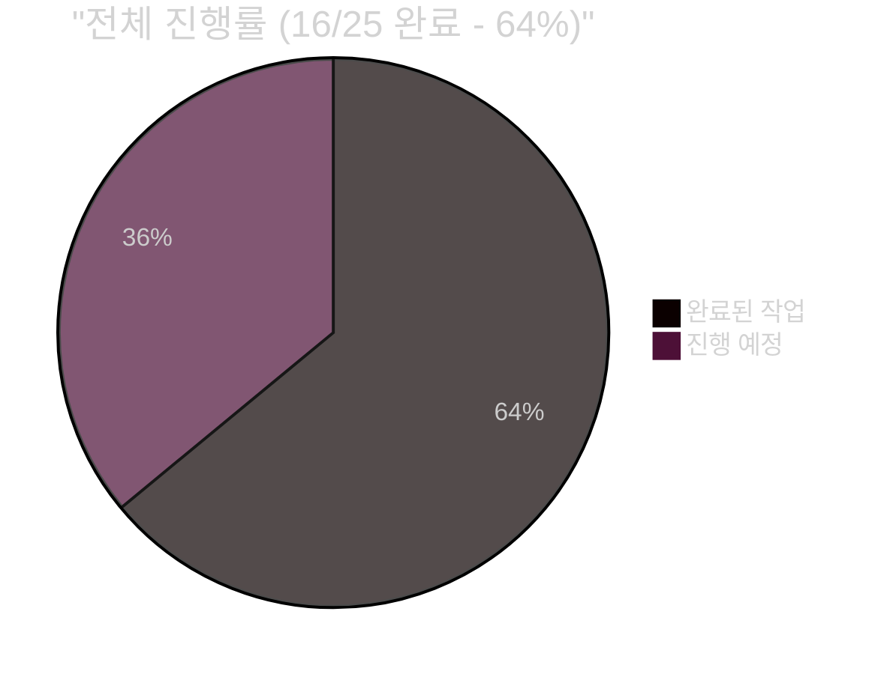
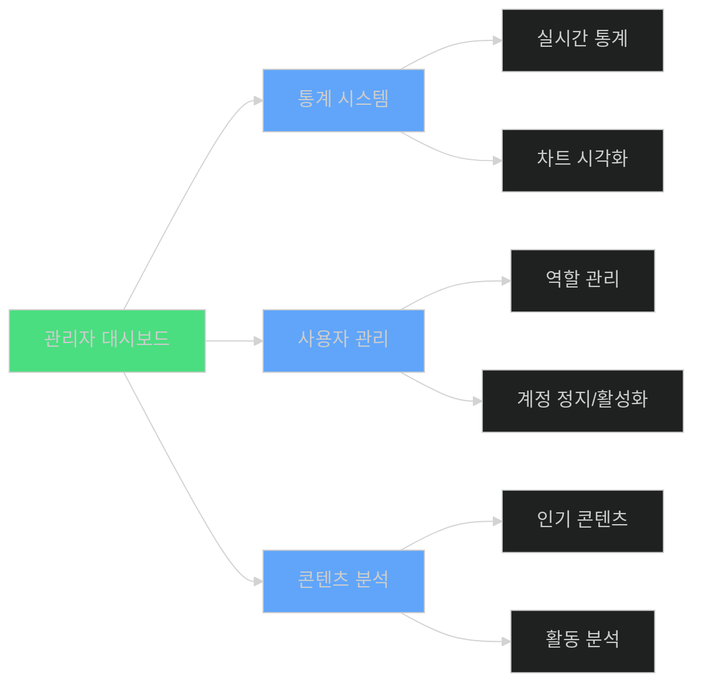
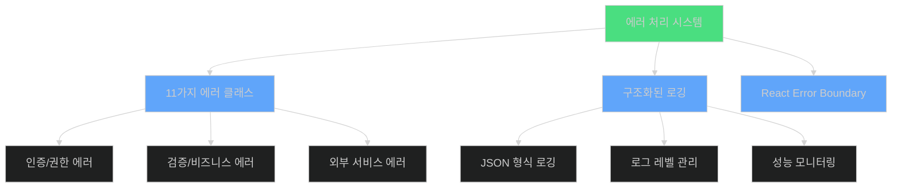
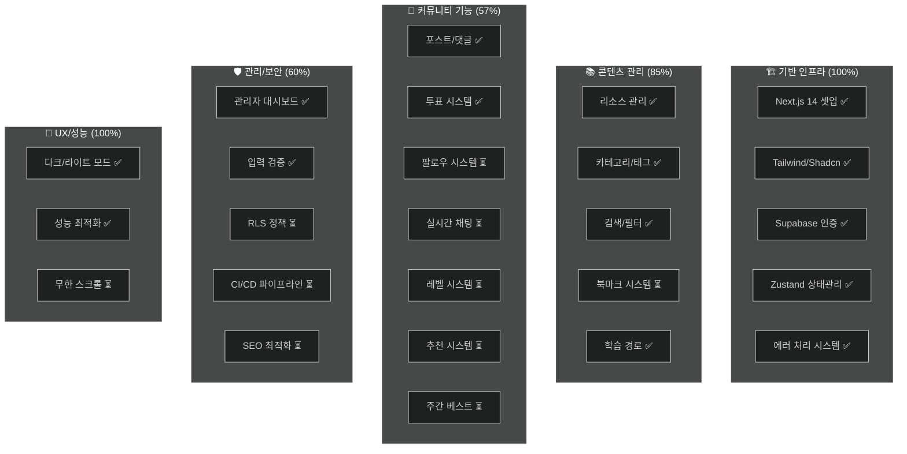
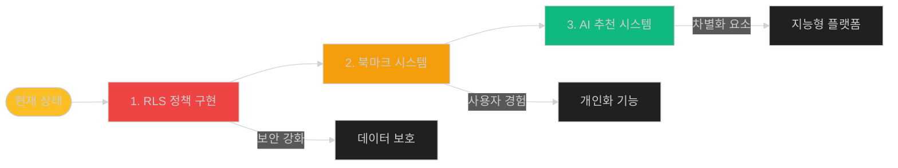
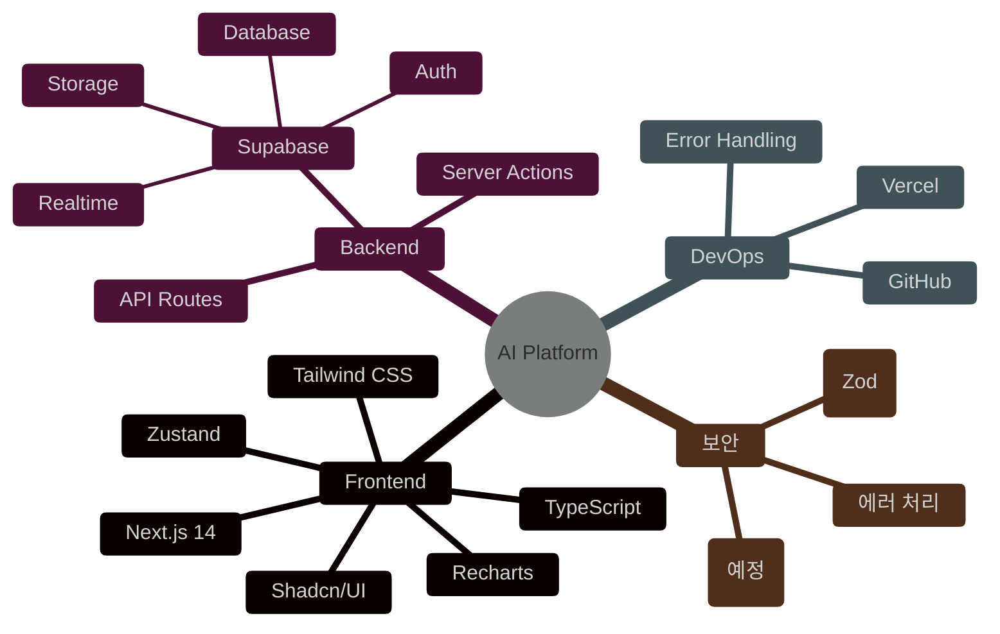

# 🚀 AI Community Platform - 프로젝트 대시보드 v7
> 마지막 업데이트: 2025-08-01

## 📊 프로젝트 진행률


## 🎯 최근 완료 작업

### Task 24: 관리자 대시보드 ✅


### Task 23: 에러 처리 및 로깅 ✅


## 📈 작업 현황 분석

### 카테고리별 진행 상황


## 🔥 현재 대기 중인 작업 (우선순위별)

### 🔴 높은 우선순위
1. **Task 20: Row Level Security (RLS)**
   - 데이터 보안의 핵심
   - 모든 테이블에 정책 적용 필요
   
2. **Task 13: AI 기반 추천 시스템**
   - OpenAI API 통합
   - 개인화된 학습 경로 제공

### 🟡 중간 우선순위
3. **Task 8: 북마크 시스템**
   - 기본 기능이지만 빠른 구현 가능
   
4. **Task 11: 사용자 레벨 시스템**
   - 커뮤니티 활성화에 중요
   
5. **Task 12: 팔로우 시스템**
   - 소셜 기능 강화

### 🟢 낮은 우선순위
6. **Task 14: 실시간 채팅**
7. **Task 15: 주간 베스트 콘텐츠**
8. **Task 18: 무한 스크롤**
9. **Task 22: CI/CD 파이프라인**
10. **Task 25: SEO 최적화**

## 💡 추천 작업 순서



## 🚀 다음 단계 추천

### 1️⃣ **Task 20: Row Level Security 구현** (2-3시간)
```typescript
// 필요한 작업:
- profiles, resources, posts 테이블 RLS 정책
- learning_paths, bookmarks 테이블 정책
- 관리자 권한 정책
- 테스트 케이스 작성
```

### 2️⃣ **Task 8: 북마크 시스템** (1-2시간)
```typescript
// 빠른 구현 가능:
- bookmarks 테이블 (이미 존재)
- 북마크 토글 API
- UI 컴포넌트 (하트 아이콘)
- 북마크 목록 페이지
```

### 3️⃣ **Task 13: AI 추천 시스템** (4-5시간)
```typescript
// 차별화 기능:
- OpenAI API 통합
- 사용자 행동 분석
- 콘텐츠 임베딩
- 개인화 알고리즘
```

## 📊 기술 스택 현황



## 🎯 프로젝트 목표 달성률

| 목표 | 진행률 | 상태 |
|------|--------|------|
| 🏗️ 기본 인프라 구축 | 100% | ✅ 완료 |
| 📚 리소스 관리 시스템 | 85% | 🔄 진행중 |
| 👥 커뮤니티 기능 | 57% | 🔄 진행중 |
| 🛡️ 보안 및 관리 | 60% | 🔄 진행중 |
| 🎨 사용자 경험 | 67% | 🔄 진행중 |
| 🤖 AI 기능 | 0% | ⏳ 대기중 |

## 🏆 완료된 주요 기능

1. ✅ **완전한 인증 시스템** (이메일/소셜 로그인)
2. ✅ **리소스 CRUD 및 검색/필터**
3. ✅ **커뮤니티 포스트/댓글/투표**
4. ✅ **학습 경로 시스템**
5. ✅ **관리자 대시보드**
6. ✅ **에러 처리 및 로깅**
7. ✅ **다크/라이트 모드**
8. ✅ **성능 최적화**

## 📝 작업 보고

최근 완료:
- **Task 24**: 관리자 대시보드 - 통계, 차트, 사용자 관리 완료
- **Task 23**: 에러 처리 시스템 - 11가지 에러 클래스, 구조화된 로깅

다음 예정:
1. RLS 정책으로 데이터 보안 강화
2. 북마크 시스템으로 개인화 기능 추가
3. AI 추천으로 차별화된 가치 제공

---
*이 대시보드는 프로젝트의 현재 상태를 실시간으로 반영합니다*
