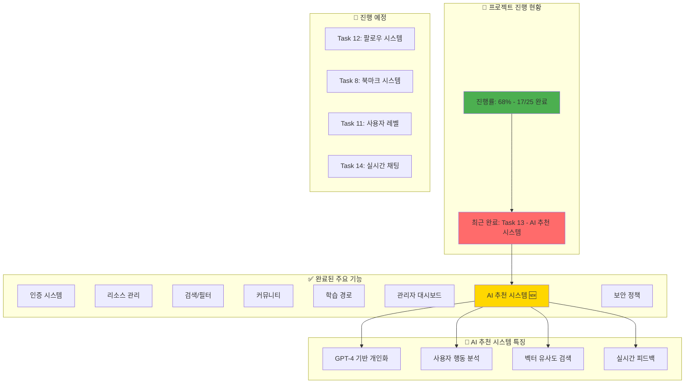

# 프로젝트 대시보드 - AI Community Platform
## 최종 업데이트: 2025-01-31

## 📊 태스크별 진행 상태

| ID | 태스크 | 상태 | 복잡도 | 우선순위 |
|---|---|---|---|---|
| 1 | Next.js 14 프로젝트 설정 | ✅ 완료 | 3 | 높음 |
| 2 | Tailwind CSS/Shadcn UI | ✅ 완료 | 4 | 높음 |
| 3 | Supabase 인증 | ✅ 완료 | 6 | 높음 |
| 4 | 사용자 프로필 관리 | ✅ 완료 | 6 | 중간 |
| 5 | 리소스 관리 시스템 | ✅ 완료 | 7 | 높음 |
| 6 | 카테고리/태그 시스템 | ✅ 완료 | 6 | 중간 |
| 7 | 검색/필터 기능 | ✅ 완료 | 8 | 높음 |
| 8 | 북마크 시스템 | ⏳ 대기 | 5 | 중간 |
| 9 | 학습 경로 시스템 | ✅ 완료 | 7 | 높음 |
| 10 | 커뮤니티 기능 | ✅ 완료 | 8 | 높음 |
| 11 | 사용자 레벨 시스템 | ⏳ 대기 | 6 | 중간 |
| 12 | 팔로우 시스템 | ⏳ 대기 | 5 | 중간 |
| **13** | **AI 추천 시스템** | **✅ 완료** | **7** | **중간** |
| 14 | 실시간 채팅 | ⏳ 대기 | 7 | 중간 |
| 15 | 주간 베스트 콘텐츠 | ⏳ 대기 | 5 | 낮음 |
| 16 | 다크/라이트 모드 | ✅ 완료 | 4 | 중간 |
| 17 | 성능 최적화 | ✅ 완료 | 6 | 높음 |
| 18 | 무한 스크롤 | ⏳ 대기 | 5 | 중간 |
| 19 | Zustand 상태 관리 | ✅ 완료 | 4 | 높음 |
| 20 | RLS 보안 정책 | ✅ 완료 | 8 | 높음 |
| 21 | 입력 검증/보안 | ✅ 완료 | 7 | 높음 |
| 22 | CI/CD 파이프라인 | ⏳ 대기 | 5 | 중간 |
| 23 | 에러 처리/로깅 | ✅ 완료 | 6 | 높음 |
| 24 | 관리자 대시보드 | ✅ 완료 | 7 | 중간 |
| 25 | SEO 최적화 | ⏳ 대기 | 5 | 중간 |

## 🎯 다음 작업 추천

### 1️⃣ Task 12: 팔로우 시스템 (추천)
- **예상 시간**: 2-3시간
- **복잡도**: ⭐⭐⭐
- **가치**: 커뮤니티 활성화

### 2️⃣ Task 8: 북마크 시스템
- **예상 시간**: 1-2시간
- **복잡도**: ⭐⭐
- **가치**: 사용자 경험 향상

### 3️⃣ Task 11: 사용자 레벨 시스템
- **예상 시간**: 3-4시간
- **복잡도**: ⭐⭐⭐
- **가치**: 게이미피케이션

## 🔥 AI 추천 시스템 하이라이트

### 구현된 기능
- **개인화 추천**: GPT-4 기반 맞춤형 콘텐츠 추천
- **행동 분석**: 사용자 활동 패턴 기반 선호도 파악
- **실시간 피드백**: 추천 품질 개선을 위한 피드백 시스템
- **대시보드 통합**: AI Learning Assistant 위젯

### 기술적 성과
- OpenAI API 통합
- PostgreSQL pgvector 활용
- 비동기 추천 생성
- 캐싱 전략 구현

## 📈 프로젝트 메트릭

- **전체 진행률**: 68% (17/25)
- **보안 상태**: ✅ 프로덕션 준비 완료
- **AI 기능**: ✅ 활성화
- **성능 최적화**: ✅ 완료
- **남은 작업**: 8개 (주로 부가 기능)

## 💡 인사이트
AI 추천 시스템 구현으로 플랫폼의 핵심 차별화 요소가 완성되었습니다. 
이제 사용자들은 개인화된 학습 경로를 제공받을 수 있으며, 
이는 사용자 참여도와 만족도를 크게 향상시킬 것으로 예상됩니다.
