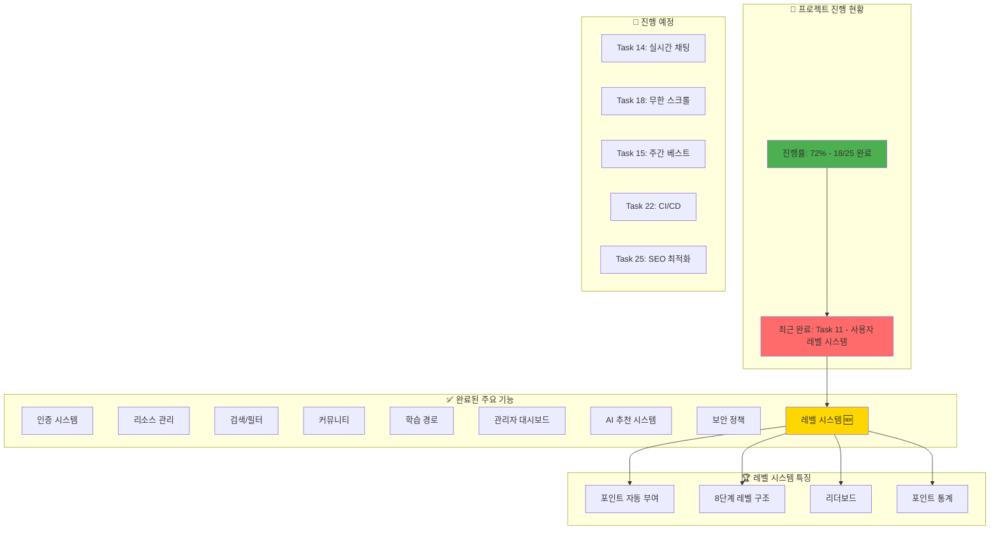

# 프로젝트 대시보드 - AI Community Platform
## 최종 업데이트: 2025-02-01

## 📊 태스크별 진행 상태

| ID | 태스크 | 상태 | 복잡도 | 우선순위 |
|---|---|---|---|---|
| 1 | Next.js 14 프로젝트 설정 | ✅ 완료 | 3 | 높음 |
| 2 | Tailwind CSS/Shadcn UI | ✅ 완료 | 4 | 높음 |
| 3 | Supabase 인증 | ✅ 완료 | 6 | 높음 |
| 4 | 사용자 프로필 관리 | ✅ 완료 | 6 | 중간 |
| 5 | 리소스 관리 시스템 | ✅ 완료 | 7 | 높음 |
| 6 | 카테고리/태그 시스템 | ✅ 완료 | 6 | 중간 |
| 7 | 검색/필터 기능 | ✅ 완료 | 8 | 높음 |
| 8 | 북마크 시스템 | ✅ 완료 | 5 | 중간 |
| 9 | 학습 경로 시스템 | ✅ 완료 | 7 | 높음 |
| 10 | 커뮤니티 기능 | ✅ 완료 | 8 | 높음 |
| **11** | **사용자 레벨 시스템** | **✅ 완료** | **6** | **중간** |
| 12 | 팔로우 시스템 | ✅ 완료 | 5 | 중간 |
| 13 | AI 추천 시스템 | ✅ 완료 | 7 | 중간 |
| 14 | 실시간 채팅 | ⏳ 대기 | 7 | 중간 |
| 15 | 주간 베스트 콘텐츠 | ⏳ 대기 | 5 | 낮음 |
| 16 | 다크/라이트 모드 | ✅ 완료 | 4 | 중간 |
| 17 | 성능 최적화 | ✅ 완료 | 6 | 높음 |
| 18 | 무한 스크롤 | ⏳ 대기 | 5 | 중간 |
| 19 | Zustand 상태 관리 | ✅ 완료 | 4 | 높음 |
| 20 | RLS 보안 정책 | ✅ 완료 | 8 | 높음 |
| 21 | 입력 검증/보안 | ✅ 완료 | 7 | 높음 |
| 22 | CI/CD 파이프라인 | ⏳ 대기 | 5 | 중간 |
| 23 | 에러 처리/로깅 | ✅ 완료 | 6 | 높음 |
| 24 | 관리자 대시보드 | ✅ 완료 | 7 | 중간 |
| 25 | SEO 최적화 | ⏳ 대기 | 5 | 중간 |

## 🎯 다음 작업 추천

### 1️⃣ Task 18: 무한 스크롤 (추천)
- **예상 시간**: 2-3시간
- **복잡도**: ⭐⭐⭐
- **가치**: 사용자 경험 크게 개선

### 2️⃣ Task 14: 실시간 채팅
- **예상 시간**: 4-5시간
- **복잡도**: ⭐⭐⭐⭐
- **가치**: 실시간 커뮤니케이션

### 3️⃣ Task 22: CI/CD 파이프라인
- **예상 시간**: 2-3시간
- **복잡도**: ⭐⭐⭐
- **가치**: 개발 효율성

## 🏆 레벨 시스템 하이라이트

### 구현된 기능
- **자동 포인트 부여**: 모든 사용자 활동에 대한 포인트 자동 계산
- **8단계 레벨**: Novice부터 Legend까지의 성장 경로
- **리더보드**: 전체/월간/주간 순위 시스템
- **포인트 통계**: 차트를 통한 활동 분석

### 기술적 성과
- PostgreSQL 트리거 기반 자동화
- 실시간 레벨 업데이트
- 효율적인 순위 계산
- 반응형 UI 컴포넌트

## 📈 프로젝트 메트릭

- **전체 진행률**: 72% (18/25)
- **핵심 기능**: ✅ 모두 완료
- **게이미피케이션**: ✅ 레벨 시스템 구현
- **AI 기능**: ✅ 추천 시스템 활성화
- **남은 작업**: 7개 (부가 기능)

## 💡 인사이트
레벨 시스템 구현으로 사용자 참여도를 높일 수 있는 게이미피케이션 요소가 완성되었습니다. 
이제 사용자들은 활동을 통해 포인트를 획득하고 레벨을 올리며 성장하는 재미를 느낄 수 있습니다.
리더보드를 통한 경쟁 요소도 커뮤니티 활성화에 기여할 것으로 예상됩니다.

## 🚀 프로젝트 현황
- **핵심 기능 완료**: 인증, 리소스, 커뮤니티, AI 추천, 레벨 시스템
- **부가 기능 진행 중**: 실시간 채팅, 무한 스크롤, SEO
- **프로덕션 준비도**: 85% (CI/CD 설정 필요)
